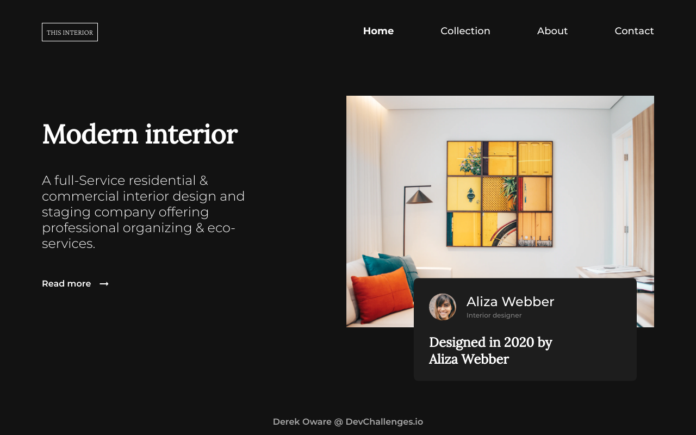

<h1 align="center">Interior Consultant - Challenge</h1>

   Solution for a challenge from  <a href="http://devchallenges.io" target="_blank">Devchallenges.io</a>.

  <h3>
    <a href="https://interior-consultant-neon.vercel.app">
      Demo
    </a>
     | 
    <a href="https://github.com/dchole/interior-consultant">
      Solution
    </a>
     | 
    <a href="https://devchallenges.io/challenges/Jymh2b2FyebRTUljkNcb">
      Challenge
    </a>
  </h3>

<!-- TABLE OF CONTENTS -->

## Table of Contents

- [Overview](#overview)
  - [Built With](#built-with)
- [Features](#features)
- [Contact](#contact)

<!-- OVERVIEW -->

## Overview

At last, I was able to to achieve pixel-almost-perfect 😁

### Built With

- [HTML](https://developer.mozilla.org/en-US/docs/Web/HTML)
- [CSS](https://developer.mozilla.org/en-US/docs/Web/CSS)
- [GSAP](https://greensock.com/)

## Features

This site was created as a submission to a [DevChallenges](https://devchallenges.io/challenges) challenge. The [challenge](https://devchallenges.io/challenges/Jymh2b2FyebRTUljkNcb) was to build a site to complete the given user stories.

## Contact

- Website [Brains](https://brains.hashnode.dev)
- GitHub [@Dchole](https://github.com/Dchole)
- Twitter [@DerekOware2](https://twitter.com/DerekOware2)
